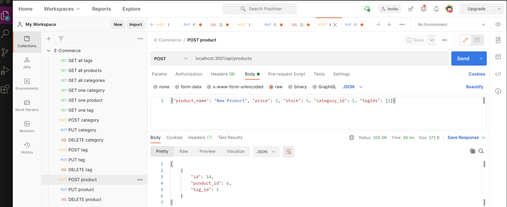

# E-Commerce-Back-End

## Walkthrough Video
https://drive.google.com/file/d/13T5iRb6aItJDJOvAvz98YmRoFzaJ05Ia/view

## Description
This is a back-end application for an e-commerce website built using Sequelize to interact with a MySQL database. Image and video show example usage in the Postman app. This application can be used to GET data for each route (categories, products and tags), as well as CREATE, UPDATE and DELETE data. 



## Installation

Run the following commands in the terminal to use the application:

```npm i```<br>
to install all dependencies<br><br>
```npm run seed```<br>
to seed the database<br><br>
```node server.js```<br>
to connect the server

## Technologies

Project is created with 
- Javascript
- Node.js
- Sequelize
- MySQL2
- Express
- Dotenv

## Questions

If you have any questions, please contact me at https://github.com/kilaweeks or kilaweeks@gmail.com.

